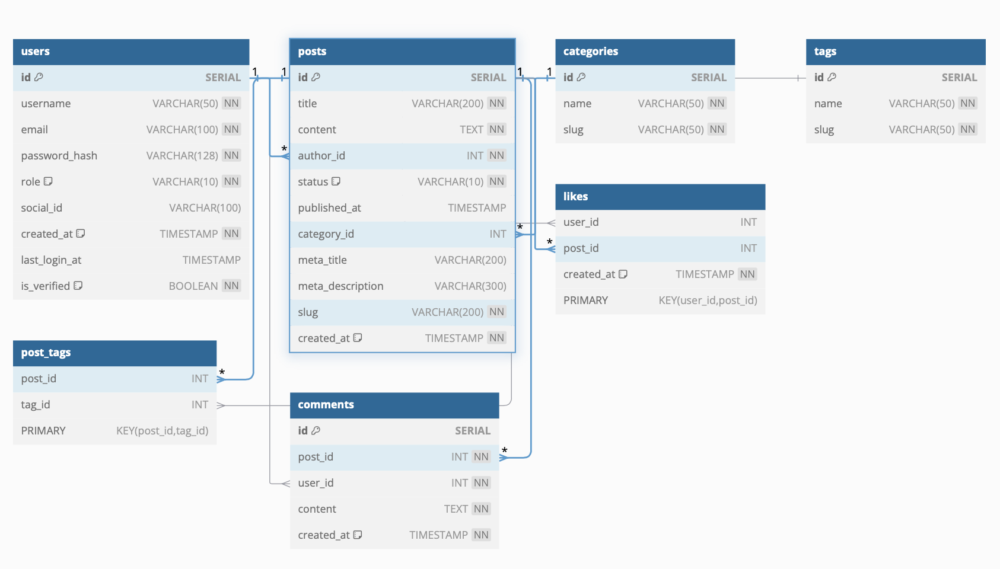

# Blog Website API (Rust)

A high-performance, secure, and scalable blog API built with Rust, Actix-Web, and PostgreSQL. Designed to support a future Angular frontend.

## Table of Contents
- [Features](#features)
- [Tech Stack](#tech-stack)
- [Architecture](#architecture)
- [API Endpoints](#api-endpoints)
- [Database Schema](#database-schema)
- [Setup & Installation](#setup--installation)
- [Deployment](#deployment)
- [Testing](#testing)
- [Future Roadmap](#future-roadmap)
- [Contributing](#contributing)

---

## Features
- **User Management**
  - Registration/login with JWT and OAuth2 (Google/GitHub).
  - Roles: Admin, Author, Guest.
  - Email verification and password reset.
- **Blog Post Management**
  - Markdown/HTML support with XSS sanitization.
  - Categories, tags, scheduled posts, and drafts.
- **Moderation**
  - Admin dashboard for post/comment moderation.
- **SEO Optimization**
  - Slug-based URLs, meta titles, and descriptions.
- **Scalability**
  - Stateless API, async I/O, and connection pooling.

---

## Tech Stack
| Component               | Choice(s)                                                                 |
|-------------------------|---------------------------------------------------------------------------|
| **Framework**           | Actix-Web (async)                                                        |
| **Database**            | PostgreSQL + Diesel (ORM)                                                |
| **Auth**                | JWT, OAuth2 (`oauth2` crate)                                             |
| **CI/CD**               | GitHub Actions + Docker                                                  |
| **Hosting**             | AWS ECS (Docker), RDS (PostgreSQL), S3 (assets)                          |
| **Monitoring**          | `tracing` (logs), Prometheus (metrics)                                   |
| **Frontend**            | Angular (separate repo)                                                  |

---

## Architecture
### Database Schema (ER Diagram)

*Screenshot of the database schema designed in dbdiagram.io*
- **Tables**: `users`, `posts`, `categories`, `tags`, `comments`, `likes`.
- **Relationships**:
  - `posts` → `users` (author), `categories` (1:1), `tags` (many-to-many).
  - `comments` → `posts` and `users`.

### API Design
- **RESTful endpoints** with JSON responses.
- **Versioned routes**: `/api/v1/`.
- **Rate limiting**: 100 requests/minute for public endpoints.
- **CORS**: Restricted to Angular frontend origins.

---

## API Endpoints
| Endpoint                | Method | Description                          | Auth Required       |
|-------------------------|--------|--------------------------------------|---------------------|
| `/auth/register`        | POST   | Register with email/password         | No                  |
| `/auth/login`           | POST   | Login (returns JWT)                  | No                  |
| `/auth/google`          | GET    | OAuth2 redirect for Google           | No                  |
| `/posts`                | GET    | List posts (filter by tag/category)  | No                  |
| `/posts`                | POST   | Create a post (Markdown)             | Author/Admin        |
| `/posts/{id}/comments`  | POST   | Add a comment                        | Authenticated       |
| `/admin/posts/{id}`     | DELETE | Delete a post                        | Admin               |

[Full API Documentation](docs/API.md) <!-- Auto-generated via OpenAPI -->

---

## Setup & Installation
### Prerequisites
- Rust 1.82+
- PostgreSQL 14+
- Docker (optional)

### Steps
1. Clone the repository:
   ```bash
   git clone https://github.com/yourusername/blog-api.git
   cd blog-api
